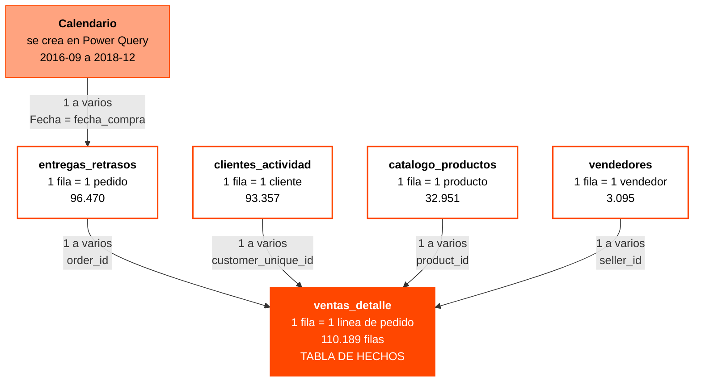

# Del CSV al dashboard

Como llevar los CSV de `output/` a Excel, montar el modelo de datos y relacionar
las tablas. El diseno del dashboard es vuestro; esto es el andamiaje.

---

## 1. Que sale del ETL

`python main.py` deja cinco ficheros en `output/`. Cada uno tiene un grano
distinto, y eso determina como se relacionan.

| CSV | Una fila es | Filas | Papel en el modelo |
| :--- | :--- | ---: | :--- |
| `ventas_detalle.csv` | una linea de pedido | 110.189 | **tabla de hechos** |
| `entregas_retrasos.csv` | un pedido entregado | 96.470 | pedidos |
| `clientes_actividad.csv` | un cliente unico | 93.357 | clientes |
| `catalogo_productos.csv` | un producto | 32.951 | productos |
| `vendedores.csv` | un vendedor | 3.095 | vendedores |

---

## 2. Cargar con Power Query

Se hace una vez por fichero.

1. `Datos` > `Obtener datos` > `Desde un archivo` > `Desde texto/CSV`.
2. Elegid el CSV de `output/`. La ruta completa esta en la hoja **Fuentes** del libro.
3. En la vista previa, antes de cargar, comprobad dos cosas:
   - **Origen del archivo**: `65001: Unicode (UTF-8)`
   - **Delimitador**: `Coma`
4. Pulsad `Transformar datos` y revisad los tipos. Las fechas tienen que quedar
   como **Fecha**, no como Texto.
5. `Cerrar y cargar en...` > **Solo crear conexion**, y marcad **Agregar estos
   datos al modelo de datos**.
6. Repetid con los cinco.

> No cargueis a hoja. Si pegais 110.189 filas en una pestana, el libro se
> arrastra. El modelo de datos aguanta millones de filas sin que las veais nunca.

---

## 3. El modelo de datos

Esta es la parte importante, y conviene entender por que es asi.

### El problema: cuatro islas

Las cuatro tablas de resumen no comparten ni una sola clave entre ellas:

| Tabla | Su clave |
| :--- | :--- |
| `clientes_actividad` | `customer_unique_id` |
| `catalogo_productos` | `product_id` |
| `vendedores` | `seller_id` |
| `entregas_retrasos` | `order_id` |

Cuatro claves distintas, cero coincidencias. Con solo esas cuatro **no se puede
construir un modelo**: cada tabla vive aislada y una segmentacion no afecta a
las demas.

No es un fallo del ETL. Es la consecuencia directa de haber agregado: cuando
resumis a nivel de cliente perdeis el pedido, y cuando resumis a nivel de
producto perdeis el cliente. **El grano que elegis decide con que vais a poder
cruzar despues.**

### La solucion: una tabla de hechos al grano mas fino

`ventas_detalle` esta al grano de **linea de pedido**, el unico nivel donde
coexisten las cuatro claves. Por eso puede unirlas todas.



Eso es un **esquema en estrella**: el hecho en el centro y las descripciones
alrededor. Es el mismo modelo que rehareis en Power BI en el Proyecto V.

### Crear las relaciones

`Datos` > `Relaciones` > `Nueva`, cinco veces:

| Tabla (lado varios) | Columna | Tabla relacionada (lado uno) | Columna |
| :--- | :--- | :--- | :--- |
| `ventas_detalle` | `order_id` | `entregas_retrasos` | `order_id` |
| `ventas_detalle` | `customer_unique_id` | `clientes_actividad` | `customer_unique_id` |
| `ventas_detalle` | `product_id` | `catalogo_productos` | `product_id` |
| `ventas_detalle` | `seller_id` | `vendedores` | `seller_id` |
| `entregas_retrasos` | `fecha_compra` | `Calendario` | `Fecha` |

Excel pide siempre primero la tabla del lado **varios**. `ventas_detalle` ocupa
ese lado en cuatro de las cinco: un cliente tiene muchas lineas, un producto
aparece en muchas lineas.

Fijaos en la ultima. El calendario **no** se conecta a `ventas_detalle`, sino a
`entregas_retrasos`. Si lo conectarais a las dos habria dos caminos entre el
calendario y las lineas, y Excel desactivaria uno por ambiguo. Con un solo
camino el filtro fluye solo: calendario, pedidos, lineas.

### La tabla Calendario

Excel no la trae hecha. `Obtener datos` > `De otras fuentes` > `Consulta en
blanco`, y en el Editor avanzado:

```m
let
    Inicio = #date(2016, 9, 1),
    Fin = #date(2018, 12, 31),
    Dias = List.Dates(Inicio, Duration.Days(Fin - Inicio) + 1, #duration(1, 0, 0, 0)),
    Tabla = Table.FromList(Dias, Splitter.SplitByNothing(), {"Fecha"}),
    Tipo = Table.TransformColumnTypes(Tabla, {{"Fecha", type date}}),
    Anio = Table.AddColumn(Tipo, "Anio", each Date.Year([Fecha]), Int64.Type),
    Mes = Table.AddColumn(Anio, "Mes", each Date.Month([Fecha]), Int64.Type),
    NombreMes = Table.AddColumn(Mes, "NombreMes", each Date.MonthName([Fecha]), type text),
    AnioMes = Table.AddColumn(NombreMes, "AnioMes", each Date.ToText([Fecha], "yyyy-MM"), type text),
    Trimestre = Table.AddColumn(AnioMes, "Trimestre", each "T" & Text.From(Date.QuarterOfYear([Fecha])), type text)
in
    Trimestre
```

Los datos de Olist van del 15-09-2016 al 29-08-2018. El rango de arriba va algo
mas ancho a proposito, para que no falte ningun dia.

Sin tabla de calendario solo podeis agrupar por la fecha exacta. Con ella podeis
agrupar por mes, trimestre y ano, y comparar periodos.

---

## 4. La regla de oro al hacer dinamicas

**Las medidas salen siempre de `ventas_detalle`.**

Las otras tablas llevan columnas numericas (`gasto_total`, `ingresos`,
`unidades_vendidas`, `nota_media`) calculadas **a su propio grano**. Sirven para
ordenar y filtrar, no para sumar en una dinamica cruzada.

Un ejemplo de lo que sale mal: si poneis `catalogo_productos[ingresos]` en una
dinamica segmentada por el estado del cliente, Excel mostrara el mismo total en
todos los estados. No es un error de Excel. El filtro viaja del lado "uno" al
lado "varios" y nunca al reves, asi que el estado del cliente no puede filtrar
la tabla de productos. La suma correcta sale de `ventas_detalle[importe_linea]`.

| Para esto | Usad |
| :--- | :--- |
| Sumar dinero, unidades o lineas | `ventas_detalle` |
| Cortar por cliente, producto, vendedor o fecha | las tablas de alrededor |
| Ordenar un top 10 | la columna precalculada de esa tabla |
| Medir entregas y notas | `entregas_retrasos`, que esta al grano de pedido |

---

## 5. Cuatro dinamicas para empezar

Ninguna es posible sin el modelo. Esa es la demostracion de que el modelo sirve
para algo.

1. **Facturacion por mes y categoria.**
   Filas `Calendario[AnioMes]`, columnas `catalogo_productos[categoria]`,
   valores suma de `ventas_detalle[importe_linea]`.
   Cruza tres tablas que entre ellas no se tocan.

2. **Top 10 vendedores y su nota media.**
   Filas `vendedores[seller_id]`, valores suma de `importe_linea` y promedio de
   `entregas_retrasos[nota]`. Filtro de los 10 primeros por importe.

3. **Retraso medio por estado del cliente.**
   Filas `clientes_actividad[estado]`, valores promedio de
   `entregas_retrasos[dias_desvio]` y recuento de pedidos.

4. **Peso del flete sobre la factura, por categoria.**
   Filas `catalogo_productos[categoria]`, suma de `flete` entre suma de
   `importe_linea`, las dos de `ventas_detalle`.

Una segmentacion de `Calendario[Anio]` tiene que mover las cuatro a la vez. Si
alguna no se inmuta, falta una relacion.

---

## 6. Actualizar

```bash
python main.py
```

y en Excel, `Datos` > `Actualizar todo`.

El orden importa: primero el script regenera los CSV, luego Excel los relee. Si
actualizais sin ejecutar el script, vereis los datos de antes.

---

## 7. Que entregar

- Los cinco CSV cargados al modelo de datos
- Las cinco relaciones de la tabla de arriba
- Tablas dinamicas construidas sobre ese modelo
- Un dashboard montado a partir de esas dinamicas

Mientras lo montais, apuntad que querriais hacer y no podeis. Esa lista es el
guion del Proyecto V, donde este mismo modelo se rehace en Power BI con medidas
DAX e interactividad de verdad.

## Una advertencia

No guardeis los CSV como hojas pegadas. Si lo haceis, el libro deja de
actualizarse solo y el proyecto pierde la mitad de su sentido.
